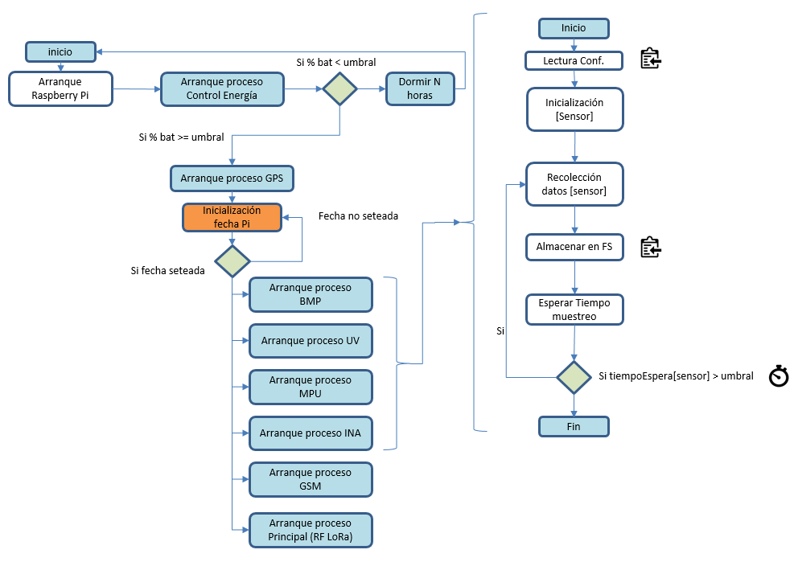

- [HAB_sonda](#hab-sonda)
  * [Introducción](#introducción)
  * [Diseño](#dise-o)
    + [Introducción](#introducción-1)
    + [Diagrama del Hardware](#diagrama-del-hardware)
    + [Diagrama del Software](#diagrama-del-software)
  * [Modulos](#modulos)
    + [Introducción](#introducción-2)
    + [BMP](#bmp)
    + [MPU](#mpu)
    + [GPS](#gps)
    + [RF](#rf)
    + [UV](#uv)
    + [INA](#ina)
    + [GSM](#gsm)
    + [Camara](#camara)
    + [Bateria](#bateria)
    + [Proceso Principal](#proceso-principal)

# HAB_sonda

## Introducción

Proyecto1 que recoge el código fuente base de una sonda de tipo HAB basada en Raspbian (Raspberry Pi ,3B o Zero W) y la gestión de la operación de sistemas diversos (Temperatura, Presión, Camara, Barometros, GPS, Radio Lora, Telemetria por SM, otros)

El proyecto se divide en varios directorios

- <b>hav</b>: Acronimo de High Altitude Vehicle, donde se almacena todo el código de los diferentes componentes que integran la sonda.
- <b>conf</b>: Directorio donde se almacena la configuración de los módulos que hay definidos en "hav"
- <b>services</b>: La definición de los daemons de los procesos que corren sobre cada sensor/componente que integra la sonda
- <b>test</b>: Directorio de pruebas donde se valida parte del software que hay en hav.

## Diseño

### Introducción

El software para la sonda esta pensado de forma que todos los procesos de generación de datos y de envio de datos se ejecuten como un proceso diferente. Luego, un proceso principal, que es el encargado de leer los archivos de datos que los procesos de los modulos de sensores van dejando y enviarlos por alguno de los mecanismos implementados (RF-Lora o SMS-GSM)

Este sistema permite que, en caso de fallo de alguno de estos sensores, buses u otros componentes, el resto de procesos sigan funcionando correctamente.

Además, en esta versión se mirará de incluir un sistema de tipo watchdog, que se encargue de evaluar la carga de la bateria en el arranque para decidir si continua con el arranque o no. El objetivo de este sistema es asegurarse que, en caso de descarga de la bateria, el sistema intentará con la carga que le quede, diversos intentos de arranques (asumiendo que la bateria se irá cargando con placas solares poco a poco).

### Diagrama del Hardware


### Diagrama del Software



## Modulos

### Introducción

Como se ha indicado, la idea es que cada componente nuevo que se agrege, se conciba como un servicio que se ejecute en el arranque de la pi en un orden preestablecido y con las dependencias que se desee.

Para poder arrancar el servicio de un componente:

1. Se debe disponer del archivo [Nombre_modulo.service] donde se ha de describir, genericamente, lo siguiente:

```
[Unit]
Description=[nombre_en_systemctl_del_servicio]
After=multi-user.target

[Service]
Type=idle
ExecStart=/usr/bin/python /[path_hubicación_proceso_python_arranque_servicio]/[nombre_servicio].py
Restart=always
RestartSec=0

[Install]
WantedBy=multi-user.target
```

2. Copiar el archivo del servico al directorio de systemd
```
sudo cp [nombre_servicio].service /etc/systemd/system/[nombre_servicio].service
```

3. Refrescar la lista de servicios y activar el nuevo que se desea dar de alta.
```
sudo systemctl daemon-reload
sudo systemctl enable [nombre_servicio].service
```

<b>IMPORTANTE</b>: Asegurarse que el script de python definido en el [Nombre_modulo.service] tiene permisos de ejecución (chmod 755)
### BMP

4. Finalmente, para arrancar o parar el servicio una vez la el SO haya arrancado, utilizar.
```
sudo systemctl start [nombre_servicio].service

o

sudo systemctl stop [nombre_servicio].service
```

#### Introducción

El módulo BMP testado es el BMP280. Básicamente se trata de un sensor de presión y temperatura all-in.

#### Descripción

Las funcionalidades de este sensor lo hacen especialmente interesante:
- Presión: Ofrece datos de presión atmosferica a nivel del mar en Pa (Pascales).
- Temperatura: Temperaturas en ºC
- Altura Barométrica: En base a la presión y la temperatura, dispone de modelos atmosféricos primitivos pero relativamente precesios de la altura a la que se encuentra el sensor. La altura es en metros.

### MPU

#### Introducción

[TODO]

#### Descripción

[TODO]

### GPS

#### Introducción

[TODO]

#### Descripción

[TODO]

### RF

#### Introducción

[TODO]

#### Descripción

[TODO]

### UV

#### Introducción

El sensor UV es el encargado de registrar la radiación ultravioleta. Para ello se utilizará el sensor VEML6070.

#### Descripción

Para poder usar este sensor, aparte de disponer de la libreria, es necesario activar el bus I2C en la Pi. Para poder hacerlo, seguir los pasos siguientes:

1. Ejecutar: 

```
sudo raspi-config
```

2. Navegar por las opciones siguientes [Interfacing Options -> I2C -> Activate]. Pasados unos segundos el I2C queda activado.

A modo de comprobación, se puede utilizar la herramienta i2c-detect, simplemente ejecutando "i2cdetect -y 1" en linea de comandos y donde se muestra los dispositivos que estan usando el mapa de registros del I2C

```
pi@raspberrypi:/data/lirevenas/hav $ i2cdetect -y 1
     0  1  2  3  4  5  6  7  8  9  a  b  c  d  e  f
00:          -- -- -- -- -- -- -- -- -- -- -- -- --
10: -- -- -- -- -- -- -- -- -- -- -- -- -- -- -- --
20: -- -- -- -- -- -- -- -- -- -- -- -- -- -- -- --
30: -- -- -- -- -- -- -- -- 38 39 -- -- -- -- -- --
40: -- -- -- -- -- -- -- -- -- -- -- -- -- -- -- --
50: -- -- -- -- -- -- -- -- -- -- -- -- -- -- -- --
60: -- -- -- -- -- -- -- -- -- -- -- -- -- -- -- --
70: -- -- -- -- -- -- -- --
```

[TODO]

### INA

#### Introducción

[TODO]

#### Descripción

[TODO]

### GSM

#### Introducción

[TODO]

#### Descripción

[TODO]

### Batería

#### Introducción

[TODO]

#### Descripción

Se han verificado varias baterias con el INA3221 para verificar cuando la raspberry pi queda sin funcionamiento:

- 16650 de 2000mh, max: 4.12V y min 2.5V

### Camara

#### Introducción

Este punto hace referencia explicitamente a la Pi cam, o la camara que puede conectarse directamente a la PI por CSI??.

#### Descripción

El modelo de la camara es: [TODO]

Su operación se hace a través de dos librerias de Python denominadas **PIL** y **picamera**. Previamente hay que haber instalado estos módulos en pyton con PIP.

Ejecutar:

```
sudo pip install picamera
```


### Proceso Principal

#### Introducción

[TODO]

#### Descripción

[TODO]


