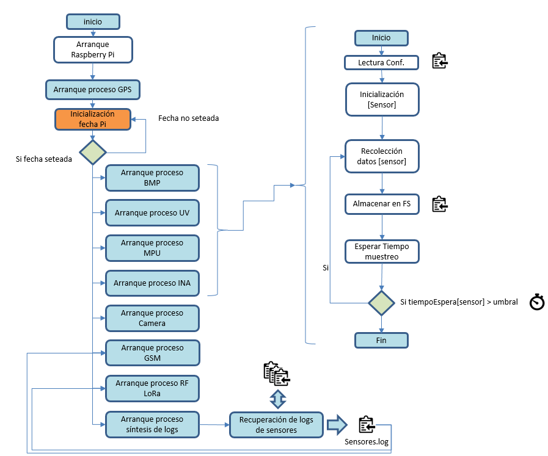

- [HAB_sonda](#hab-sonda)
  * [Introducción](#introduccion)
  * [Diagrama de Sistemas](#diagrama-de-sistemas)
  * [Getting Started](#getting-started)
  * [Configuraciones Genericas](#configuraciones-genericas)
    + [Generación de Servicios](#generacion-de-servicios)
    + [Activación I2C en Raspbian](#activacion-i2c-en-raspbian)
    + [Activación Cámara](#activacion-camara)
  * [Componentes](#componentes)
    + [BMP](#bmp)
    + [MPU](#mpu)
    + [GPS](#gps)
    + [RF](#rf)
    + [UV](#uv)
    + [INA3221](#ina3221)
    + [INA219](#ina219)
    + [DS18B20](#ds18b20)
    + [GSM](#gsm)
    + [Camara](#camara)
    + [Proceso Principal](#proceso-principal)
    + [Servicio de Configuración](#servicio-de-configuracion)
  * [Logging](#logging)
    + [Introduccion](#introduccion-12)
    + [Tipos de log](#tipos-de-log)
  * [Hardware](#hardware)
    + [Diagrama del Hardware](#diagrama-del-hardware)
    + [Bus I2C](#bus-i2c)
    + [USBs](#usbs)
    + [Listado de componentes](#listado-de-componentes)
    + [Tecnicas y procedimientos de ensamblado](#tecnicas-y-procedimientos-de-ensamblado)
- [Anexos](#anexos)
  * [Cambio frecuencias lora](#cambio-frecuencias-lora)
    + [Introduccion](#introduccion-3)
    + [Requisitos previos](#requisitos-previos)
    + [Esquema electrico](#esquema-electrico)
      - [Cableado de Configuración](#cableado-de-configuraci-n)
      - [Cableado de Operación](#cableado-de-operaci-n)
    + [Configuracion Lora](#configuracion-lora)
    + [Verificación](#verificaci-n)
  * [Instalación Raspbian.](#instalacion-raspbian)
    + [Requisitos previos](#requisitos-previos)
    + [Proceso de Instalación](#proceso-de-instalacion)
  * [ndvi](#ndvi)

# HAB_sonda

## Introduccion

Proyecto que recoge el código fuente base de una sonda de tipo HAB basada en Raspbian (Raspberry Pi ,3B o Zero W) y que pueda trabajar con diferentes tipos de sensores (Temperatura, Presión, Camara, Barometros, GPS, Radio Lora, Telemetria por SM, otros), que recupere datos de los mismos y los pueda enviar a una estación terrestre para, como objetivo final, poder ser recuperada y reutilizada.

## Diagrama de Sistemas

El software para la sonda esta pensado de forma que todos los procesos de generación de datos y de envio de datos se ejecuten como un proceso del Sistema Operativo (Raspbian) aislado. Cada uno de estos procesos tiene su propio control de errores y su configuración. Además, cada uno de ellos generan un archivo de log y otro de datos. En el archivo de datos, con la frecuencia configurada, aparecen los datos de dicho sensor.

Luego, un proceso principal, que es el encargado de leer los archivos de datos que los procesos de los modulos de sensores van dejando y conformar lo que será la traza de sensores final. Notar que, los diferentes instrumentos configurados pueden tener tiempos de muestreo diferentes, esto implica que, en el momento de ejecución de este proceso principal, se tomaran los últimos datos que existan en los archivos de datos de cada uno de los sensores. Esto es importante porque lo que se acabará enviando por RF o SMS no es mas que una síntesis de los datos generados. Para poder tener todos los datos con su máxima precisión, es imprescindible recuperar la sonda.

La traza fusión con todos los datos es recuperada por los procesos de envio de datos (RF-Lora o SMS-GSM), que funcionan igual que los procesos de sensores, de forma aislada, enviando los datos que puedan encontrarse en el archivo unificado de trazas.

Este sistema permite que, en caso de fallo de alguno de estos sensores, buses u otros componentes, el resto de procesos sigan funcionando correctamente, aumentando la robustez del sistema. Esta arquitectura además permite una gran escalabilidad, pudiendo añadir sistemas nuevos o sistemas resilientes llegado al caso, con suma facilidad.



## Getting Started

Este apartado esta pensado para, sin tener el detalle exacto de todos los componentes y tecnicas que se explican mas adelante, poner en funcionamiento el software de la sonda.</br>
<b>IMPORTANTE:</b> En este tutorial se asume que se dispone de una raspberry pi zero o equivalente con una versión de raspbian instalada correctamente. Si se esta en este punto, consultar el punto de instalación de raspbian y luego volver a este punto.

Los pasos son:

1. Disponer de una raspberry Pi con una versión de raspbian instalada y funcionando correctamente. Ejecutar antes de nada:

<code>
sudo apt get update
</code>

Este paso actualizará la lista de librerias y dependencias iniciales del raspbian

2. Conectar todos los sistemas periféricos (camara, sensores, etc.)

3. Activar el bus I2C. 
Para poder realizar esta acción ver el punto [Activación I2C en Raspbian](#activacion-i2c-en-raspbian)

4. Instalar librerias de Python3 de apoyo. Las librerias de python necesarias son las siguientes:
   * image
   * picamera
   * adafruit-circuitpython-ina219
   * i2cdevice
   * W1ThermSensor
   * ...
   
y la forma de instalarlas es mediante la instrucción
```
   sudo pip3 install [nombre_libreria]
```

<b>NOTA:</b> Es muy importante utilizar sudo para la instalación de las librerias, ya que la instalación con pip3 instala la libreria para el usuario que ejecuta la instrucción. Si no se instala con sudo, al crear posteriormente los servicios, es posible que estos fallen al no poder utulizar las librerias instaladas con el usuario pi (usuario por defecto)

5. Instalar librerias del SO necesarias para algunas dependencias del componente software de la camara integrada.

```
sudo apt-get install libopenjp2-7
sudo apt-get install libtiff5
``` 

6. Realizar un clone del proyecto hab_sonda sobre la raspberry

   El proceso es simple.
   
   1. Abrir una consola del SO.
   2. Posicionarse en el directorio que se desee (se recomienda /data, NOTA: se puede crear con los comandos:

<code>
cd /

mkdir data
</code>

   3. Ejecutar la instrucción de clonado del repositorio "hab_sonda" con el comando:

<code>
cd /data
	
git clone https://github.com/Yggdrassil80/hab_sonda

</code>
<b>IMPORTANTE</b>: Inmediatamente despúes de realizar esta accion, todo el código de la sonda se encontrará en /data/hab_sonda. Esto implica que todas las configuraciones dependeran de ese path base.

7. Si no existe, crear manualmente el directorio images:

<code>
cd /data/hab_sonda/

mkdir images
</code>

8. Configurar el archivo de configuración.
   1. Para realizar esta acción se ha de configurar el archivo /data/hab_sonda/conf/hav.conf
   2. Los detalles de configuración de cada sensor se pueden consultar en la sección de configuración de cada módulo descritos en la sección [Componentes](#componentes)

* <b>NOTA</b>: Llegado es punto, si se deseara (si no se tiene experiencia, se recomienda no hacerlo), se puede cambiar el nombre "hab_sonda" por el nombre que se desee. Esto se puede hacer utilizando los comandos siguiente:

<code>
cd /data/hab_sonda

grep -rli 'hab_sonda' * | xargs -i@ sed -i 's/hab_sonda/nombre_nuevo/g' @
</code>

Para que los cambios no provoquen errores de configuración, todo el directorio de configuración debería cambiar también a /data/nombre_nuevo

Esto se puede hacer utilizando el comando:

<code>
mv -rf /data/hab_sonda /data/nombre_nuevo
</code>

9. Configurar y activar los servicios. Ver el punto [Generacion de Servicios](#generacion-de-servicios)

## Configuraciones Genericas

### Generacion de Servicios

Los servicios son programas que correran en modo desatendido, sin que se observe su ejecución de forma directa, y que trabajaran por detrás con los diferentes sensores y componentes que tendrá la sonda.
Estos servicios, una vez configurados (siguiendo las instrucciones siguientes) harán que, siempre que se arranque la raspberry, estos se ejecuten en el arranque de esta y por consiguiente, no sea necesario volver a tener que arrancarlos manualmente. Esto tiene como objetivo que si la raspberry se reiniciase por cualquier motivo durante el vuelo, al volver a arrancar, todos estos servicios que manejan los sensores, radio, gps y demas, volverian a funcionar.

Existen una serie de servicios mínimos necesarios para que la sonda, funcionalmente, tenga sentido, y son los siguientes:

* gps.service
* habMain.service
* lora1.service

La definición de estos servicios se puede encontrar en el directorio /data/hab_sonda/hav/services.

El resto de servicios actualmente disponibles operan con diferentes sensores y sistemas que se pueden considerar secundarios.

Si se desea mas detalle de estos servicios y de estos tres que se consideran mínimos, se puede consultar la sección de [Componentes](#componentes). 

Los servicios para poder configurarse por primera vez han de cargarse en el arranque del Raspbian, para poder hacer esto, seguir el procedimiento siguiente por cada servicio que se desee activar:  

1. Se debe disponer del archivo [Nombre_modulo.service] donde se ha de describir, genericamente, lo siguiente:

```
[Unit]
Description=[nombre_en_systemctl_del_servicio]
After=multi-user.target

[Service]
Type=idle
ExecStart=/usr/bin/python3 /[path_hubicación_proceso_python_arranque_servicio]/[nombre_servicio].py
Restart=always
RestartSec=0

[Install]
WantedBy=multi-user.target
```

2. Copiar el archivo del servico al directorio de systemd

<code>
sudo cp [nombre_servicio].service /etc/systemd/system/[nombre_servicio].service
</code>

3. Refrescar la lista de servicios y activar el nuevo que se desea dar de alta.
<code>
sudo systemctl daemon-reload

sudo systemctl enable [nombre_servicio].service
</code>

<b>IMPORTANTE</b>: Asegurarse que el script de python definido en el [Nombre_modulo.service] tiene permisos de ejecución (chmod 755)

4. Finalmente, para arrancar o parar el servicio una vez la el SO haya arrancado, utilizar.

<code>
sudo systemctl start [nombre_servicio].service
</code>

o

<code>
sudo systemctl stop [nombre_servicio].service
</code>

Finalmente, comentar que estas acciones estan actualmente automatizadas a traves de un script en el directorio /data/hav_sonda/utilities. 

En dicho directorio se encuentran 3 scritps que agilizan la gestion de los servicios

- <b>habCatServiceEnabler.sh</b>: Su ejecución ejecuta los pasos de esta seccion del 1 al 4 para todos los servicios que se encuentren en el archivo services.conf
- <b>habCatServiceDisabler.sh</b>: Su ejecución para todos los servicios y posteriormente los desabilita del arranque que se encuentren en el archivo services.conf
- <b>habCatServiceOp.sh {status/start/stop}</b>: Su ejecución permite obtener el estado de los servicios (status) pararlos (stop) o arrancarlos (start) que se encuentren en el archivo services.conf

para poder ejecutar cualquiera de estos comandos, posicionarse en el directorio utilities y ejecutar:

<code>
sudo ./{nombre_script}.sh {opciones_si_las_tuviera}
</code>

Sobre el archivo services.conf, se encuentra en /data/hav_sonda/utilities y unicamente contiene una linea con el nombre de los servicios separados por un espacio simple. Este archivo determina que servicios se cargaran en el arranque de la pi y el orden en que se desea que arranquen.

### Activacion I2C en Raspbian

El bus I2C permite el mapeo de los componentes que estan conectados al mismo a través de una serie de registros de datos y control. Estos registros son específicos por cada componente, leyendo y escribiendo en estos registros de la forma indicada por cada fabricante es como se controlan.

Para poder activar el bus I2C en la Pi. Se han de seguir los pasos siguientes:

1. Ejecutar: 

```
sudo raspi-config
```

2. Navegar por las opciones siguientes [Interfacing Options -> I2C -> Activate]. Pasados unos segundos el I2C queda activado.

3. sudo apt-get install i2c-tools

A modo de comprobación, se puede utilizar la herramienta i2c-detect, simplemente ejecutando "i2cdetect -y 1" en linea de comandos y donde se muestra los dispositivos que estan usando el mapa de registros del I2C

```
pi@raspberrypi:/data/hab_sonda/hav $ i2cdetect -y 1
     0  1  2  3  4  5  6  7  8  9  a  b  c  d  e  f
00:          -- -- -- -- -- -- -- -- -- -- -- -- --
10: -- -- -- -- -- -- -- -- -- -- -- -- -- -- -- --
20: -- -- -- -- -- -- -- -- -- -- -- -- -- -- -- --
30: -- -- -- -- -- -- -- -- 38 39 -- -- -- -- -- --
40: -- -- -- -- -- -- -- -- -- -- -- -- -- -- -- --
50: -- -- -- -- -- -- -- -- -- -- -- -- -- -- -- --
60: -- -- -- -- -- -- -- -- -- -- -- -- -- -- -- --
70: -- -- -- -- -- -- -- --
```

### Activacion Camara

Si se desea utilizar la camara de la raspberry pi que estaría conectada a través del puerto SPI de la pi será preciso antes habilitarla.

De forma muy similar a la activación del bus I2C, se han de ejecutar los siguientes comandos:

1. Ejecutar:

```
sudo raspi-config
```

2. Navegar por las opciones siguientes [Interfacing Options -> Camera -> Activate]. Pasados unos segundos la camara queda activada.

<b>IMPORTANTE</b> La configuración solicitará reiniciar la pi.

## Componentes

### BMP

#### Introducción

El módulo BMP testado es el BMP280. Básicamente se trata de un sensor de presión y temperatura all-in.

#### Descripción

Las funcionalidades de este sensor lo hacen especialmente interesante:
* Presión: Ofrece datos de presión atmosferica a nivel del mar en Pa (Pascales).
* Temperatura: Temperaturas en ºC
* Altura Barométrica: En base a la presión y la temperatura, dispone de modelos atmosféricos primitivos pero relativamente precesios de la altura a la que se encuentra el sensor. La altura es en metros.

Puede utilizarse para medir temperaturas externas o internas de la sonda, depende donde se ubique.

#### Conexión

Este componente se conecta a la Pi a través del bus I2C, luego no tiene requerimientos de conexión especiales.

Para la activación del bus I2C, revisar la sección de configuración "Activación I2C en Raspbian".

#### Calibración

Para conseguir unas medidas de temperatura y presión lo mas correctas posibles, es necesario calibrar adecuadamente dichos sensores. 

Existen dentro del código del módulo del BMP280 que se puede encontrar en hav/BMP280/BMP280.py hay un par de métodos que se pueden utilizar para este menester, el compensate_temperature y el compensate_pressure.

#### Configuración

El módulo dispone de confguración específica en el archivo conf/hav.conf

<code>
bmp_activo=1

tiempoMuestreoBMP=10
</code>

donde,

- <b>bmp_activo</b>: informa sobre el estado de activación del modulo, 0 o 1 en función de si se desea que este activo o no.
- <b>tiempoMuestreoBMP</b>: informa sobre el tiempo de toma de datos del sensor.

Más información en su datasheet [aquí](https://cdn-shop.adafruit.com/datasheets/BST-BMP280-DS001-11.pdf)

### MPU

#### Introducción

El sensor de MPU permite conocer la orientacion espacial de la sonda mediante el calculo de la acceleración (3 ejes), inclinación (3 ejes) y orientación magnetica (3 ejes).

El sensor con el que se trabajará es el MPU9250, que integra un giroscopio convencional para aceleración e inclinación y un magnetómetro para la orientación magnetica.

#### Descripción

Este sensor recupera los valores siguientes:
- ax: aceleración en el eje X
- ay: aceleración en el eje Y
- az: aceleración en el eje Z
- gx: inclinación en el eje X
- gy: inclinación en el eje Y
- gz: inclinación en el eje Z
- ox: orientación magnética en el eje X
- oy: orientación magnética en el eje Y
- oz: orientación magnética en el eje Z
- temp: temperatura del sensor embebido que lleva el circuito

En el caso de los sensores con magnetometros y giroscopios, para poder obtener medidas correctas y precisas, es necesario calibrar estos sistemas.

La calibración es un proceso algo mas complejo pero que se puede abordar perfectamente a través de una série de utilidades que se han desarrollado.

Se puede encontrar información de la calibración en el apartado siguiente.

#### Conexión

Este componente se conecta a la Pi a través de un bus I2C, con lo que no tiene ninguna complicación.

Para la activación del bus I2C, revisar la sección de configuración "Activación I2C en Raspbian".

#### Calibración

No se tratará en este proyecto.

#### Configuracíón

El módulo dispone de confguración específica en el archivo conf/hav.conf

<code>
mpu_activo=1
	
tiempoMuestreoMPU=11
</code>
donde,

- <b>mpu_activo</b>: informa sobre el estado de activación del modulo, 0 o 1 en función de si se desea que este activo o no.
- <b>tiempoMuestreoMPU</b>: informa sobre el tiempo de toma de datos del sensor.

Más información en su datasheet [aquí](https://components101.com/processors/mpu9250-9-axis-digital-motion-processor)

### GPS

#### Introduccion

El GPS, permite determinar la ubicación exacta de la sonda. Su presencia y buen funcionamiento es capital para la recuperación de la misma.

#### Descripción

El GPS sobre el cual se basado este desarrollo es el UBLOX NEO 6M que también se ha demostrado compatible con el UBLOX NEO 7.

Lo que se desea del GPS es que retorne constantemente la altura, la latitud y la longitud de la sonda. Estos datos son solo unos de los pocos que se pueden extraer del GPS.

Actualmente, los chips de UBLOX operan con protocolo NMEA2.0 que se basa en la generación de una série de mensajes con datos de tiempos, velocidades, posiciones, etc.

Se puede encontrar mas información aqui: https://www.gpsinformation.org/dale/nmea.htm

Se ha desarrollado un módulo propio que interpreta los mensajes NMEA que se consideran interesantes para conocer los datos de altura, longitud y latitud de la sonda (GCRMC y el GCACC).

#### Conexión 

Los chips de ublox estan configurados para empezar a volcar sus datos directamente por el puerto serie. Con un simple adaptador a USB (CP2102) se puede utilizar practicamente desde cualquier sistema operativo o plataforma que soporte USB.

#### Calibrado

Este componente no requiere ninguna acción de calibrado especial, ya que tras el encendido empieza a calcular su posición el solo. Para ganar una precisión adecuada de pocos metros, si hace mucho que no se usa, puede requerir unos minutos (5 o 10 min).

#### Configuración

A diferencia de otros componentes, los chips de UBLOX de GPS requieren de configuración inicial dependiendo de lo que se desee hacer con ellos.

En nuestro caso, nuestra aplicación implica que se alcanzaran alturas de entre 30 a 40km en el mejor de los casos, y practicamente ningun GPS convencional mide tales alturas de fabrica.

Además, existe un organismo internacional, COCOM que limita la altura a la cual estos sistemas civiles pueden operar. Nominalmente esta en 18km como maximo, pero dependendiendo del fabricante hay limites en 9 o 12km.

Superado este limite, el comportamiento del componente es diverso, en función del fabricante. En el caso de UBLOX, los datos de lat, lon y altura se quedan "congelados" hasta que se recupera una altura inferior a la del límite de configuración.

Para solventar esto, el componente de GPS desarrollado implementa una libreria especial que permite la configuración de GPS de UBLOX mediante su protocolo de comunicaciones de fabricante (UBX). Luego, cada vez que se arranca el módulo de GPS, se lanza una configuración que activa el modo "airbone<1g" que permite la operación del chip hasta alturas de 50km.

Otras configuraciones adicionales son aplicadas también, como el filtrado de paquetes de NMEA, para solo capturar los GCRMC y GCACC.

Adicionalmente, también existen configuraciones estáticas en el archivo conf/hav.conf

<code>
usbGPS=/dev/ttyUSB0

tiempoMuestreoGPS=10
</code>

donde,

- <b>usbGPS</b>: corresponde al puerto USB al que esta conectado el adaptador cp2102 del GPS. Es importante destacar que este puerto puede cambiar en función de los dispositivos conectados a la raspberry y el slot USB donde se conecten, con lo que se deberá comprobar manualmente que esta configuración es correcta.
- <b>tiempoMuestreoGPS</b>: que informa sobre el tiempo entre muestras de datos de GPS. Es importante destacar que el GPS no empieza a dar datos de posición de forma inmediata cuando arranca, sino que requeriere unos minutos de "autocalibrado" antes de empezar a recibir paquetes NMEA con datos (GCRMC y GCACC). Luego, suponiendo la configuración correcta de USB, se puede entender como normal que no haya datos de posición nada mas arrancar.

Más información en su datasheet [aquí](https://www.u-blox.com/sites/default/files/products/documents/NEO-6_DataSheet_(GPS.G6-HW-09005).pdf)

### RF

#### Introduccion

El modulo de RF que se utilizará es un ebyte E32-TTL-100 que esta basado en la tecnologia LoRa (Long Range) del chip SX1278 de Semtech.

Esta tecnología permite el envio de mensajes con muy poca energia a grandes distancias a coste eso si de un ancho de banda muy bajo.

Se utiliza para el envio de datos tomados por los sensores exceptuando las imagenes o videos de la cámara, ya que el ancho de banda no lo permite.

#### Descripción

El módulo seleccionado permite de ebyte viene ya preconfigurado. Se conecta a la raspberry a través del puerto serie y, mediante un adaptador CP2102, a un slot USB.

Dispone además de dos pines de configuración, M0 y M1 que, para que pueda funcionar en modo recepción y emisión han de estar a 0V (ojo, no en Z). Osea, conectados al GND de la PI.

Para poder configurar los parametros internos del chip M0 y M1 han de configurarse ambos a 1 lógico (5 V).

Toda la configuración los parametros de LoRa del chip se basa en el parametro de airrate que viene a ser el ancho de banda con el que transmite el chip.

Los siguientes parámetros de configuración de LoRa son los que corresponden a cada airRate.

 * 0.3 Kbps, BW:125Mhz, SF: 12, CR: 4/5
 * 1.2 Kbps, BW:250Mhz, SF: 11, CR: 4/5
 * 2.4 Kbps, BW:500Mhz, SF: 12, CR: 4/5
 * 4.8 Kbps, BW:250Mhz, SF: 8, CR: 4/6
 * 9.6 Kbps, BW:500Mhz, SF: 8, CR: 4/6
 * 19.2 Kbps, BW:500Mhz, SF: 7, CR: 4/6

 donde,

 * BW: Significa BandWith
 * SF: Spread Factor
 * CR: Coding Rate

La frecuencia central se encuentra en los 433 Mhz. Si se desea cambiar la frecuencia de operación se puede consultar como hacerlo en el siguiente enlace del [Anexo](#Cambio-frecuencias-lora).

No se tiene información sobre que sync_word o que longitud de preambulo se esta usando.

El airRate por defecto es de 2.4 Kbps.

El modulo de software desarrollado para este chip aisla todos estos elementos de configuración del desarrollador. 

Se ha de dejado un único método al cual se le pasa una cadena de texto (que representa, por ejemplo una linea del sensores.log) y la envia sin mas.

#### Configuración

Existe configuración estática para este modulo en el archivo de configuración conf/hav.conf

<code>
usbRF=/dev/ttyUSB2
</code>

donde,

- <b>usbRF</b>: corresponde al puerto USB al que esta conectado el adaptador cp2102 del componente de RF (Lora ebyte). Es importante destacar que este puerto puede cambiar en función de los dispositivos conectados a la raspberry y el slot USB donde se conecten, con lo que se deberá comprobar manualmente que esta configuración es correcta.

<b> IMPORTANTE: </b> Para que exista comunicación entre dos componentes de este tipo, ambos han de estar configurados en la misma frequencia y canal.

Más información en su datasheet [aquí](http://forum.arduino.cc/index.php?action=dlattach;topic=502618.0;attach=228256)

### UV

#### Introducción

El sensor UV es el encargado de registrar la radiación ultravioleta. Para ello se utilizará el sensor VEML6070.

#### Descripción

Actualmente el componente de UV solo mide los watts/m2 de radiación UV que le llegan al sensor. Es posible configurar este nivel de radiación con el estandar de peligrosidad que esta reconocido internacionalmente.

Los valores serian del 1 al 7 y a cada uno de ellos le corresponde tantos watts/m2.

Este indice no esta aun implementado.

Mas información en su datasheet [aquí](https://www.alldatasheet.com/view.jsp?Searchword=Veml6075&gclid=Cj0KCQiAnb79BRDgARIsAOVbhRqGm509nclCrdP307paU4pcb2jqKwJ6gcn2kXBONcwi0nqNO-tNmtsaAudAEALw_wcB)

#### Configuracíón

El módulo dispone de confguración específica en el archivo conf/hav.conf

<code>
uv_activo=1

tiempoMuestreoUV=10
</code>

donde,

* <b>uv_activo</b>: informa sobre el estado de activación del modulo, 0 o 1 en función de si se desea que este activo o no.
* <b>tiempoMuestreoUV</b>: informa sobre el tiempo de toma de datos del sensor.

### INA3221

#### Introducción

Los módulos INA permiten conocer el voltaje e intensidad que circulan por alguna de sus entradas.

Este módulo es muy util para conocer cual es el estado de la bateria o voltajes y corrientes generadas por potenciales paneles solares.

#### Conexión

El módulo ina3221 se conecta a través del bus I2C, con lo que no es precisa ninguna conexión especial salvo la alimentación, que se recomienda que se externa a 5V.

Para la activación del bus I2C, revisar la sección de configuración "Activación I2C en Raspbian".

#### Descripción

Esta versión de INA es la 3221 que permite, en un solo chip, hasta 3 canales de medida de voltajes e intensidades. Ahora bien, en las pruebas se ha constatado que se los canales estan comunicados, y que sin adaptaciones importantes en el módulo, no se pueden utilizar de forma aislada.

Si se usa solo para medir un canal, las medidas son correctas.

Los datos que permite recuperar son voltaje e intensidad.

* <b>NOTA</b>: Es conveniente recordar que para que las medidas sean las correctas, para medir intensidad, el canal utilizado ha de estar en serie con el circuito y para medir voltaje, en paralelo.

Más información en su datasheet [aquí](https://www.alldatasheet.com/view.jsp?Searchword=Ina3221%20datasheet&gclid=Cj0KCQiAnb79BRDgARIsAOVbhRpiWS_J8SuHYHrsdyR1O_YKbvQJCmxB1GAHMc7wUeQHWpWxA4hbMc0aAlveEALw_wcB)

#### Configuracíón

El módulo dispone de confguración específica en el archivo conf/hav.conf

<code>
ina3221_activo=1

tiempoMuestreoINA3221=10
</code>
	
donde,

* <b>ina3221_activo</b>: informa sobre el estado de activación del modulo, 0 o 1 en función de si se desea que este activo o no.
* <b>tiempoMuestreoINA3221</b>: informa sobre el tiempo de toma de datos del sensor.

### INA219

#### Introducción

De forma analoga al ina3321 este módulo permite conocer la intensidad y el voltage que circula a través de sus dos entradas, V+ y V-.

Se puede utilizar para controlar el estado de las baterias. A diferencia del Ina3221 solo tiene un canal.

#### Conexión

El circuito funciona a través del bus I2C de la pi. Luego deberá conectarse al SCL y al SCA de dicho puerto. Se alimenta a 5V con los que también se deberá conectar al Vcc 5V de la pi y a uno de los pines de GND también de la PI.

Para poder medir tensiones, uso mas común, la entrada V+ deberá conectarse al borne + de la bateria y el V- al borne negativo de la misma. Destacar que para que arroje medidas correctas, el V- debe estar conectado a GND, luego se ha de buscar un pin GND de la pi y conectarlo en paralelo con el - de la bateria para que las medidas de voltaje de la misma sean correctas.

#### Descripción

Esta versión del INA219 permite solo la toma de medidas de un solo canal a la vez. Luego, si se configura en paralelo (ver apartado anterior) solo se medira tensión, mientras que si se conecta en serie, solo se podrá medir intensidad.

* <b>NOTA</b>: La tensión máxima que soporta es de 26V y la intensidad máxima es de 3.2A. Eso son medidas límite que se han de intentar no alcanzar, ya que reduciran la vida útil del dispositivo.

Más información en su datasheet [aquí](https://www.alldatasheet.com/view.jsp?Searchword=Ina219%20datasheet&gclid=Cj0KCQiAnb79BRDgARIsAOVbhRrAWCmmZurJqLYQYfbHrF05BukVSrTt4Gg0IVGeFlWTICFgfiO4YUsaAkPsEALw_wcB)

#### Configuración

El módulo dispone de confguración específica en el archivo conf/hav.conf

<code>
ina219_activo=1

tiempoMuestreoINA219=10
</code>

donde,

* <b>ina219_activo</b>: informa sobre el estado de activación del modulo, 0 o 1 en función de si se desea que este activo o no.
* <b>tiempoMuestreoINA219</b>: informa sobre el tiempo de toma de datos del sensor.

Para poder utilizarlo es necesario descargar la libreria de ADAfruit correspondiente mediante la instrucción.

<code>
sudo pip3 install adafruit-circuitpython-ina219
</code>
	
### DS18B20

#### Introducción

El DS18B20 es un sensor de temperatura muy utilizado para soluciones con arduino y raspberry. Tiene un rango operativo de -55 a 125 grados celsius. Dispone de varios tipos de encapsulado pero el mas recomendado para medir temperaturas externas en un HAB seria el que viene con un recubrimiento hermético.

#### Conexión

Es muy sencilla, dispone de 3 pines, el GND y VDD que han de ir conectados a Ground y VDD (3.3v) en la raspberry. Dispone de un pin adicional de datos que por defecto siempre será el <b>GPIO4</b>. El único requisito es que se deberá configurar la interfaz "1-wire" de raspberry (procedimiento análogo a la activación del I2C, pero seleccionando 1-wire). Para ello, seguir el procedimiento siguiente:

1. Ejecutar:

```
sudo raspi-config
```

2. Navegar por las opciones siguientes [Interfacing Options -> 1-wire -> Activate]. Pasados unos segundos la interface 1-wire queda activada.

<b>IMPORTANTE</b> La configuración solicitará reiniciar la pi.

#### Configuración

Como el resto de componentes, dispone de un servicio propio denominado "dallas.service" que se configura igual que el resto de servicios disponibles. Dispone de 3 parámetros de configuración:

* <b>tiempoMuestreoDallas:</b> que informa sobre el tiempo entre muestra y muestra que se esperar el time interno del servicio para leer el sensor y escribir los datos de temperatura leídos en un archivo de datos temporal.
* <b>dallas_activo:</b> 0 o 1 indicando si el módulo esta activo o no.

### GSM

#### Introducción

Este módulo se basa en el chip sim900A. Este módulo permite el envio de mensajes SMS vía protocolo AT. Se utiliza como sistema de envio de datos redundante en caso de fallo del sistema primario basado en RF.

#### Descripción

El software que controla este modulo se ha simplificado al máximo para que simplemente se le pase a los métodos de envio un string con el SMS que se desea que se envien.

La interacción con el chip es mediante protocolo AT. El detalle de este protocolo y de todas las funcionalidades con este chip se puede encontrar [aquí](https://components101.com/wireless/sim900a-gsm-module)

Destacar que el componente lleva implementado un mecanismo de envio de SMS gobernado por la altura del GPS. El objetivo es enviar SMS solo en un rango de alturas concretos, cuando se espera que los SMSs puedan llegar.

#### Conexión

El modulo se conecta a la raspberry por puerto série y se utiliza un adaptador CP2102 para adaptar el puerto serie a USB y poder conectarlo asi a uno de los slots USB de la raspberry.

#### Configuracíón

El módulo dispone de confguración específica en el archivo conf/hav.conf

<code>
gsm_activo=1
	
alturaActivacion=300
	
alturaDesactivacion=3000
	
usbGSM=/dev/ttyUSB1
	
listaMoviles=+34666666666,+34699999999

pin=6666
	
tiempoTrazaGSM=45
</code>

donde,

* <b>gsm_activo</b>: informa sobre el estado de activación del modulo, 0 o 1 en función de si se desea que este activo o no.
* <b>tiempoTrazaGSM</b>: informa sobre el tiempo que transcurre entre el envio de datos por SMS
* <b>alturaActivacion</b>: Altura a partir de la cual el módulo intentará enviar SMSs con la última traa de datos que disponga. El valor se recomienda configurarlo 100 o 200 metros por encima de la altura del lugar de lanzamiento para que, una vez se encienda la sonda, no empiece a enviar SMS inmediatamente (ahorro de costes)
* <b>alturaDesactivacion</b>: Altura a partir de la cual el módulo de GSM dejará de enviar SMSs. Esto debe ser así porque superados los 2 o 3mil metros, ya no hay cobertura GSM (ahorro de costes)
* <b>usbGSM</b>: corresponde al puerto USB al que esta conectado el adaptador cp2102 del componente de GSM. Es importante destacar que este puerto puede cambiar en función de los dispositivos conectados a la raspberry y el slot USB donde se conecten, con lo que se deberá comprobar manualmente que esta configuración es correcta.
* <b>listaMoviles</b>: lista de numeros de telefono movil a los cuales se enviará el SMS con la traza. Es importante que el numero tengo +34 (código pais españa) y sin ningún espacio.
* <b>pin</b>: código pin de la tarjeta SIM que utiliza el componente.

### Camara

#### Introducción

Este punto hace referencia explicitamente a la Pi cam, o la camara que puede conectarse directamente a la PI por CSI. Actualmente el módulo da soporte para poder operar con la camara infraroja PiNoIR de raspberry.

#### Descripción

El módulo de control de la camara requiere de una série de librerias de python para su operación denominadas **PIL** y **picamera**. Previamente hay que haber instalado estos módulos en pyton con PIP.

Ejecutar:

<code>
sudo pip install picamera
</code>

##### Sobre NDVI

El módulo de cámara permite poder tomar imágenes modificando el balance de rojos y azules para poder procesar las imágenes tomadas a posteriori con procesamientos de tipo NDVI. Se han definido 4 propiedades adicionales que permiten la configuración. Se detallan en la sección siguiente.

Adicionalmente se ofrece una pequeña utilidad dentro del directorio /utilities/ndvi que permite el procesamiento de todas las imagenes almacenadas en el directorio de imagenes, por defecto (/data/hab_sonda/images) y las almacena procesadas en /data/hab_sonda/utilities/ndvi/ndvi.

El detalle de su funcionamiento se puede encontrar en el Anexo [ndvi](#ndvi)

#### Configuración

El módulo dispone de confguración específica en el archivo conf/hav.conf

<code>
camara_activo=1

tiempoTomaImagen=30

tiempoExposicion=3

resolucionRFX=320

resolucionRFY=240

resolucionMaxX=1920

resolucionMaxY=1080

pathImagenesBase=/data/hab_sonda/images/

ndviProcessingActive=1

ndviBasePath=/data/hab_sonda/utilities/ndvi

redAWB=2.26

blueAWB=0.74
</code>

donde,

* <b>camara_activo</b>: informa sobre si el módulo esta activo o no.
* <b>tiempoTomaImagen</b>: tiempo entre foto y foto.
* <b>tiempoExposicion</b>: tiempo de exposición del sensor cmos de la camara(equivalente al tiempo de apertura del diafragma de la camara)
* <b>resolucionRFX</b>: resolución mínima en el ejeX (anchura) de la foto que tomará la camara.
* <b>resolucionRFY</b>: resolución mínima en el ejeY (altura) de la foto que tomará la camara.
* <b>resolucionMaxX</b>: resolución máxima en el ejeX (anchura) de la foto que tomará la camara.
* <b>resolucionMaxY</b>: resolución máxima en el ejeY (altura) de la foto que tomará la camara.
* <b>pathImagenesBase:</b> path base en el filesystem del SO donde se ubicaran las fotos.
* <b>ndviProcessingActive:</b> informa si se tendran en cuenta o no las configuraciones para la toma de imágenes compatibles con el procesamiento NDVI
* <b>ndviBasePath:</b> path base donde se encuentra la utilidad para el procesamiento de los calculos NDVI
* <b>redAWB:</b> Configuración de cámara para balance de rojos
* <b>blueAWB:</b> Configuración de cámara para el balance de azules

Mas información en su datasheet [aquí](https://www.raspberrypi.org/documentation/hardware/camera/)

### Proceso Principal

#### Introducción

Como se ha comentado, todos los componentes vuelcan los datos que generan directamente a archivos de log para evitar interferir en los procesos de envio o de toma de datos de otros sensores.

Este módulo se encarga de, mediante una configuración previa, recuperar los archivos de log de los sensores que se deseen, procesarlos y dejarlos fusionados en una única traza de log que será la que utilicen los componentes de RF y GSM para enviarla.

#### Descripción

Todos los archivos de datos de los sensores tienen la forma siguiente:

<code>
timestamp|dato1|...|datoN|
</code>

el proceso recupera, en función de la lista de módulos sobre los que ha de iterar, la ultima traza de datos disponible.

Para cada una de esas trazas, coge todos los campos menos el primero, que es el timestamp, y lo concatena sobre una nueva traza que se acabará escribiendo en un archivo llamado sensores.log.

Es sobre este archivo sobre el que trabajaran los modulos de RF y GSM para poder enviar los datos que aqui hayan mediante sus respectivos protocolos.

#### Configuración

El módulo dispone de confguración específica en el archivo conf/hav.conf

<code>
tiempoMuestreo=15

configuracionTraza=gps,bmp,uv,ina3221

idMision=NOMBREMISION
</code>

donde,

* <b>tiempoMuestreo</b>: corresponde al intervalo de tiempo en el que se realizará la acción se sintesis de archivos de datos para construir una linea del archivo de datos sensores.log
* <b>configuracionTraza</b>: corresponde a la lista de modulos de los cuales se intentará recuperar archivos de datos. El orden de los datos en el archivo sensores.log lo determina el orden de los módulos de esta lista.
* <b>idMision</b>: Este valor será el string que se adjuntará a cada traza que se envíe. Es muy importante, ya que en caso de que hubiera mas HABs volando a la vez, identifica de forma unequívoca el HAB que emite trazas.

### Servicio de Configuracion

#### Introducción

El sistema de configuración es un módulo de soporte que se encarga de recuperar los datos de configuración del archivo de configuración que se le configure.

Ayuda a hacer mas mantenible el código y a una mejor parametrización del software.

#### Descripción

Se basa en una libreria interna de python denominada "configparser" que es capaz de leer configuraciones del tipo:

<code>
[nombre_seccion1]

param11=valor11

...

param1N=valor1N

...

[nombre_seccionM]

paramM1=valorM1

paramMZ=valorMX

</code>

Para cada nuevo parámetro que se dese añadir al archivo de configuración se ha de crear un método de lectura en este módulo.

## Logging

### Introducción

El software desarrollado deja gran cantidad de logs en el filesystem. Es vital entender donde estan, de que tipo son y que información se puede recuperar de ellos.

El uso de logs es una ventaja ostensible para los procesos de desarrollo y mantenimiento ya que agilizan mucho la depuración de errores y permiten el "analisis forense" de lo que puede haber ocurrido en caso de fallo.

Todos los tipos de logs, exceptuando los del propio SO raspbian, estan basados en una libreria de python denominada "logging"

Esta libreria permite declarar "appenders" o configuraciones de escritura de logs sobre un archivo concreto y con una forma concreta.

Esto homogenealiza la escritura de los logs y permite una lectura mucho mas clara. 

Otro aspecto fundamental es la adción de un timestamp, que permite darle una relación temporal a todos los eventos que se suceden durante la ejecución del código.

Finalmente, la libreria permite configurar la severidad de las trazas. Esto es, configurar el momento en el que se desea que aparezcan las trazas de log en los archivos en función de la configuración.

La severidad esta predefinida en niveles:

* debug
* info
* warn
* error

### Tipos de log

Los servicios de cada componente, una vez configurados para arrancarse en el inicio, generan, potencialmente varios tipos de logs.

* Logs de datos del componente. Acostumbran a encontrarse en /[PATH_DE_INSTALACION/hab_sonda/logs/[nombre_componente]data.log
* Logs del funcionamiento del componente. Se pueden encontrar en /[PATH_DE_INSTALACION/hab_sonda/logs/[nombre_componente]Service.log
* Logs del sistema Operativo. Se pueden encontrar en /var/log y pueden contener información relevante sobre los servicios, fallos en buses, etc.

## Hardware

En esta sección se explicarán los componentes utilizados y como ensamblarlos o conectarlos.

### Diagrama del Hardware

El diseño gira entorno a las capacidades de la raspberry de gestionar diferentes tipos de buses de datos. Se ha dado mas prioridad no a los mas eficientes si no a los mas sencillos de operar y que permiten una mayor escalabilidad a futuro.


### Bus I2C

Permite interconectar gran variedad de dispositivos con la Pi con una topologia de estrella, es decir, todos los dispositivos conectados se comportan como slave y la pi como master.

Además, utiliza solo 2 pines, el SCL y el SCA y puede implementarse un adaptador muy simple de este bus para conectar muchos dispositivos.


### USBs

En este caso, se ha optado por utilizar adaptadores CP2102 de puerto serie a USB para los componentes de GPS, RF LoRa y GSM. De esta forma pueden probarse y trabajar con ellos externamente fuera del montaje de la propia sonda y, llegado el caso y con drivers adecuados, montarlos en SOs diferentes.


### Listado de componentes

A continuación se expone la lista de componentes utilizados:

* Raspberry pi Zero W (aunque puede ser una 3B o 4) mas tarjeta de memoria (16Gb)


* Adaptador para baterias de litio de tipo 16850 y bateria


* Chip de GPS UBLOX NEO 6M o 7.


* Chips adaptadores de serie a USB CP2102


* Chip SIM900A para el envio de SMS por GSM + tarjeta SIM 


* Chip ebyte E32-TTL-100 para el envio de datos por RF LoRa en 433Mhz.


* Chip BMP280 para temperatura y presión


* Chip INA219 para control de voltage


* Chip VEML6070 para la medida de radiación UV


* Chip MPU9250 para la medida de la aceleración, inclinación y orientación.


Como material de soporte sera preciso:

* Tornilleria de m2 de nylon


* cables de circuito de tipo hembra-hembra


* Conectores para circuito


* Soporte adaptable para los circuitos (carton-pluma o equivalente)
* Antena para 433 del chip de RF


* Antena con adaptador a ufl para el GPS


* Si se usa el SIM900A, antena de GSM


* Cable de antena estrecho

* Adaptadores de cable de antena SMA (macho-hembra) y RP-SMA (macho-hembra)


De las herramientas, las mas específicas serían:

* Soldador
* Estaño
* Tornavis estrella fino (m2 o m3)

### Tecnicas y procedimientos de ensamblado

[TODO]

# Anexos

## Cambio frecuencias lora

### Introduccion

Uno de los principales problemas con los chips de Ebyte es la configuración de los parámetros internos del chip. Para poder alterar la configuración es necesario que los pins M0 y M1 estén seteados ambos a 1 (5V). Esto es un problema para con raspberry, ya que los GPIO solo son capaces de ofrecer un 1 lógico (TTL) a 3.3V.

Esto inabilita de por si una configuración por software límpia, por lo que hay que implementar un mecanismo alternativo para poder configurar el chip.

Dicho mecanismo alternativo se basará en crear un cableado especial que permita pasar 5V a los pines M0 y M1 de forma puntual, realizar su configuración y guarda en la EPROM del chip y luego, volver a dejarlos en M0 y M1 = 0 (GND) para poder operar con ellos con normalidad.

### Requisitos previos

La configuración se propone efectuarla utilizando el software propio de ebyte. Existen dos utilidades para poder trabajar con los ebytes:

<b>IMPORTANTE</b>: Estos software corren solo en SO windows. 

* RF-Setting: La ultima versión compatible con los E32-ttl-100 es [esta](https://www.ebyte.com/en/pdf-down.aspx?id=1741). Aunque se pueden buscar otras variantes de este software [aqui](https://www.ebyte.com/en/data-download.html?page=2&id=37&cid=31#load)
* Access Port: La versión compatible con el E32-ttl-100 es [esta](https://www.ebyte.com/en/pdf-down.aspx?id=204)

Además será necesario disponer de un componente de conversión de puerto serie a USB <b>Cp2102</b> y los drivers para windows de este, que se pueden descargar desde [aqui](https://www.silabs.com/documents/public/software/CP210x_Universal_Windows_Driver.zip) 

<b>NOTA</b>: En la misma web se pueden encontrar los de unix y mac, aunque no han sido testados en este tutorial.

Adicionalmente, se deberán crear un cableado especial que permimta pasar 0V al M0 y al M1, y 5V al M0 y al M1 para su configuración.


### Esquema electrico

Para poder configurar el chip será necesario realizar dos cableados diferentes, uno para configurarlo y otro para dejarlo en modo de transmisión, se denominarán de ahora en adelante <b>Cableado Configuración</b> y <b>Cableado de Operación</b> respectivamente.

#### Cableado de Configuración

El esquema de configuración es el que sigue:


#### Cableado de Operación

El esquema de Operación es el que sigue:


### Configuracion Lora

Habiendo dispuesto todos los requisitos anteriores, la configuración del chip de Ebyte se efectuaria siguiendo los pasos siguientes:

- Instalar los drivers del CP2012
- Soldar el cableado especial, ver foto anterior.
- Conectar el cable especial con el CP2012 y el chip de lora en la configuración <b>Cableado de Configuración</b>
- Arrancar el software <b>RF Settings</b>
- Conectar el CP2012 a un terminal USB del PC.
- En el RF Settings, seleccionar el idioma ingles.
- Averiguar el puerto COM donde se ha instalado el CP2012. El propio RF Settings muestra solo los COMs disponibles, se puede hacer por ensayo prueba y error o bien ir directamente a administración de dispositivos del windows y consultar que COMs hay conectados, el que nos interesa es uno que describe al CP2012.
- Una vez detectado el COM donde esta el ebyte, seleccionar OpenPort

- Posteriormente, pulsar "GetParams"


- Tras un popup informando que los parámetros han sido recuperados, estos aparecen por pantalla.

Llegado este punto, este tutorial solo se quedará en la modificación de la frecuencia central del chip. Pero existen multiples configuraciones adicionales que se podrian hacer. Sobre esto último, hay mas detalle [aquí](https://www.teachmemicro.com/e32-ttl-100-sx1278-lora-module/)

El único parámetro que interesa cambiar es la frecuencia central, por defecto, el chip esta centrado en 433Mhz, que en Hexadecial corresponde al valor 0x17 y en decimal, al 23. Es este último valor el que podemos cambiar a un número entre 0 y 39, que son las frecuencias centrales disponibles para este módulo. Estas irian de los 410Mhz (0) a los 441Mhz(39)

Se recomienda no moverse mucho de los 433Mhz por temas legales relativos al uso del espectro radio-electrico de esta banda, por lo que simplemente con indicar 22, 23 o 24 será suficiente.

- A continuación, pulsar el boton "set param" y "close port". Esto dejará en EPROM del Chip la configuración del canal central que deseemos.
- Como paso final, cambiar la configuración de cableado al <b>Cableado de Operacion</b>, de este modo el chip podrá empezar a trabajar en formato RX/TX.

<b>IMPORTANTE</b>: Este proceso se ha de repetir dos veces como mínimo!, N veces para el/los chips de la/s antena/s y otro para el chip que irá en el HAB.

### Verificación

Adicionalmente, se puede utilizar la tool "Access Port" para comprobar que los chips funcionan correctamente con su nueva configuración. Para hacer esto, realizar el siguiente procedimiento:

- Se requieren dos chips cp2012 y dos ebyte E32-ttl-100 debidamente configurados y conectados en <b>Cableado de Operacion</b>
- Una vez así, conectarlos cada uno a un puerto USB diferente del PC.
- Arrancar dos instancias diferentes de "Access Port". 
- Configurar cada una con un COM asociado a cada CP2012 (averiguar el COM mirando el administrador de dispositivos)
- A través de la interfaz grafica, escribir lo que se desee (texto cualesquiera) y observar que este aparece en la otra instancia de "Access Port" tal cual.
- Verificar el procedimiento a la inversa, escribiendo desde la otra instancia y viendo que es recibido el texto desde la primera.

## Instalacion Raspbian.

### Requisitos previos

Para poder instalar raspbian en una raspberry pi zero, 3 o 4, se han de disponer de unos materiales previos mínimos:

- Una targeta microSD de 8Gb como mínimo.
- Un adaptador para tarjetas microSD a tarjetas SD para portatil
- Un portatil o ordenador de sobremesa con lector de tarjetas SD o microSD (lo anterior no haria falta si fuera este último el caso)
- Conexion a internet.

### Proceso de Instalacion

Para realizar la instalación se han de seguir los siguientes pasos:

- Ir a la página web de [raspbian|https://www.raspberrypi.org/] y descargarse el [PI Imager|https://www.raspberrypi.org/software/] en la sección de software.
- Una vez descargado, instalarlo. 
- Arrancar el programa. Mediante la opción "Operating System" nos permitirá seleccionar el Sistema Operativo que queramos. Seleccionar "Raspberry Pi OS 32"
- Introducir la MicroSD (con o sin el adaptador) en la ranura del PC o portatil.
- En la opción "SD Card" seleccionar la microSD introducida (se deberia presentar como una unidad de disco adicional en el SO).
- Darle a "Write". El proceso dura unos minutos mientras se formatea, descarga y plancha la nueva imagen en la SD.
- Al finalizar, se pide que se extraiga la tarjeta microSD.
- Volver a insertar la tarjeta, esta vez, para copiar dos archivos en el Filesystem que nos aparezca.
       - Un archivo vacio que se llame, "ssh", tal cual, sin ningun contenido.
       - Un archivo que lo llamaremos "wpa_supplicant.conf" que tendrá la lista de SSID de las wifis que queramos que la Pi se conecte automaticamente.

Ejemplo de wpa_supplicant.conf:

country=ES</br>
ctrl_interface=DIR=/var/run/wpa_supplicant GROUP=netdev</br>
update_config=1</br>
network={</br>
	ssid="micasa"</br>
	psk="XXXXXXXXXXX"</br>
}</br>

network={</br>
	ssid="MOVISTOR_AE27"</br>
	psk="XXXXXXXXXXXXXXXXXXXXXXXXXXXXX"</br>
	key_mgmt=WPA-PSK</br>
}</br>

network={</br>
	ssid="miOtracasa"</br>
	psk="XXXXXXXXXXXXXXXXX"</br>
	key_mgmt=WPA-PSK</br>
}</br>

9.- Ahora si extraemos la tarjeta y la ponemos en la pi antes de arrancarla</br>

## ndvi

### Introduccion

Toda la información sobre esta técnica se puede obtener [aquí](https://publiclab.org/wiki/ndvi), el ejemplo concreto en el que se baso el código adaptado de esta tool es [este](https://publiclab.org/notes/petter_mansson1/04-09-2019/low-cost-ndvi-analysis-using-raspberrypi-and-pinoir)

### Herramientas

Se ha creado una pequeña utilidad que permite que, imagenes capturadas con la configuración de la cámara compatible con NDVI, puedan ser procesadas a posteriori.

<b>IMPORTANTE:</b> La utilidad se ha creado a partir del código de GITHUB de la entrada de ejemplo anterior, que es [esta](https://github.com/PiddePannkauga/ndviMachine)

El código se ejecuta en <b>python2</b> no en python3, como el resto del código de este repositorio.

El código tiene una dependencia externa que hay que cargarla para que funcione correctamente:

```
sudo pip3 install matplotlib
```

### Funcionamiento

El procedimiento para hacer funcionar la tool es el siguiente:

1.- Se asume que dentro del directorio /data/hav_sonda/images se encontraran todas las imágenes tomadas por la cámara con la configuración NDVI aplicada.
2.- Ejecutar la siguiente instrucción:

```
cd /data/hab_sonda/utilities/ndvi
python mainNDVI.py
```

3.- Si ha funcionado correctamente, el procesamiento informará logs de este tipo en la salida del comando:

```
[ndviProcess] Arrancando Procesamiento de imagenes por NDVI...:
[ndviProcess] NDVIWorkspacePath: /data/hab_sonda/utilities/ndvi
[ndviProcess] imageBasePath: /data/hab_sonda/images
[ndviProcess] Procesando imagen: 21-04-18-15-46-14-HD.png ...
[imgNDVIProcess] image: /data/hab_sonda/images/21-04-18-15-46-14-HD.png
[imgNDVIProcess] processedImgFilename: /data/hab_sonda/images
[imgNDVIProcess] imageOutPath: /data/hab_sonda/utilities/ndvi/ndvi/ndvi_21-04-18-15-46-14-HD.png
[ndviProcess] Todas las imagenes procesadas OK!
```

4.- Finalmente, las imágenes transformadas podrán encontrarse dentro del directorio /data/hab_sonda/utilities/ndvi/ndvi.


